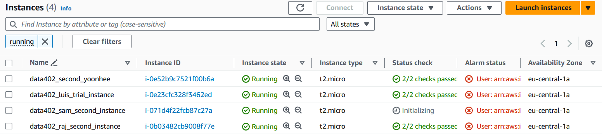

## Creating instance/VMs in AWS

Type 'EC2' into AWS searchbar.

Select 'launch instance', it's an orange button 

You should be on a page called 'Launch an instance'.

When you are naming your instance, spaces are not allowed, but underscores and dashes are available instead. 

In the application that you want to use, select Ubuntu.  This assigns the configuration of the software you will be connecting to with your SSH key.

Select Ubuntu Server 22.04, and select 'Confirm changes' if a warning screen comes up. 

Notice that Ubuntu is a 'Verified Provider'.

In the 'Instance type' section, select t2.micro, a minimal yet capable set of resources for training purposes. 

In 'Key pair (login)' select your pair from the drop down menu, or create your own. In our case, choose 'DataStudents', an rsa based SSH key pair.

In 'Network Settings', the only settings we should be editing right now are 'Firewall (security groups)'. Select an existing security group and choose your pre-existing set of rules from the drop-down menu. If you are creating a new group, make sure to name it something so you can differentiate it later. 

In 'Configure Storage', make sure you have 1x8 GiB gp2 Root volume (Not encrypted) selected.

You can now press 'Launch instance', which will initially set your security group measures before linking to your Virtual Machine.

You can click on the link in the green Success bar, to initialise the console view of your instance. 

At the top of the resulting menu, you can see that AWS is sorting to find instances with your address only. If you want to see other instances, delete this tag and type 'running' as the new tag, and press enter. 