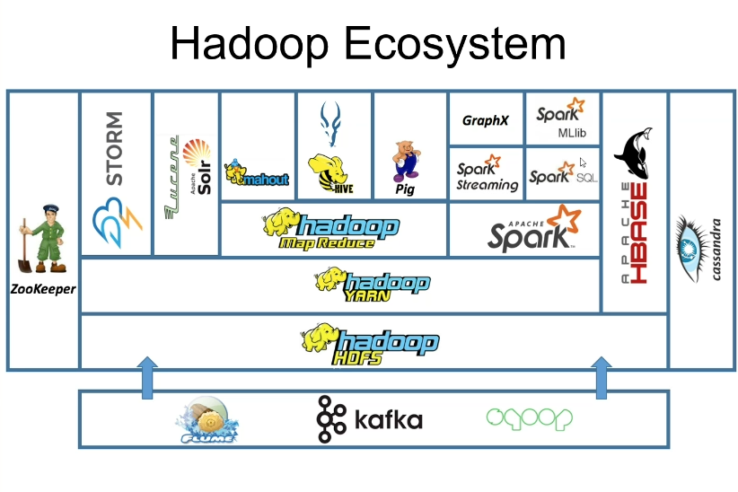

# Introduction to Apache Hadoop

##NoSQL
 
What is it?
Compare SQL to NoSQL
What language(s) can be used?
Example NoSQL Schema design
NoSQL is scalable. Explain the concept and some benefits of it. Any negatives?
Types of NoSQL Database?
 
MongoDB:
What is MongoDB?
What are collections in Mongo? 
What are Documents? 
MongoDB Architecture, how does it work? 
What are replica sets?
What is sharding?
Advantages of MongoDB?
Disadvantages of MongoDB?
What scenarios is MongoDB good for?
What scenarios is it not good for?

### Apache Hadoop is an open-source software which scales big data processing, to multiple different servers.

There are three main components of Hadoop:
* HDFS
  * stands for Hadoop Distributed File System
  * a file system which allows high-throughput (rapidly processes input data through automation) access to application data
  * works by **rapidly transferring data** between nodes.
* YARN
  * stands for Yet Another Resource Negotiator
  * allows multiple machines to manage data held across multiple servers
  * schedules operations to **maximise use of resources**
  * a global ResourceManager and **per-application** ApplicationMaster exist.
* MapReduce
  * Java-based framework which works on scaling data down through aggregation
  * **Mapping stage**: processing data into key-value pairs
  * **Reducing stage**: aggregates the mapped data

## Hadoop Ecosystem
The **Hadoop Ecosystem** contains some tools which extend the functionality of Apache Hadoop:

Here is an overview of the tools in this diagram:
### Zookeeper
A highly reliable, open-source service which co-ordinates requests across ditributed cloud servers.

Zookeeper's operations are carried out over multiple servers, called its **ensemble**.

### Flume
Flume specialises in **log data** hence the name. This could be moving or aggregating large amounts.
  Log data is the record of all the events that have happened in a system. It helps with the maintenance of a system and handling errors within it.

### Kafka
An open-source **streaming system** (it can handle real-time data feeds quickly, through decoupling data streams).
It can integrate data from multiple streaming sources and produces a similar streaming output to HDFS.

### HBase
HBase is a non-relational, and column-oriented DBMS. It does **not** allow default indexing of data, one must manually index the data.
It is similar to **Cassandra** in that it is a NoSQL database which stores data as key-value pairs.