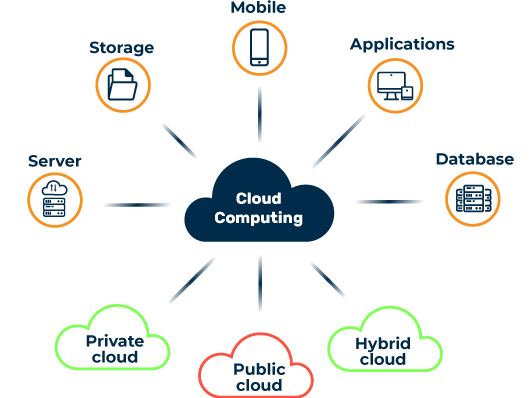
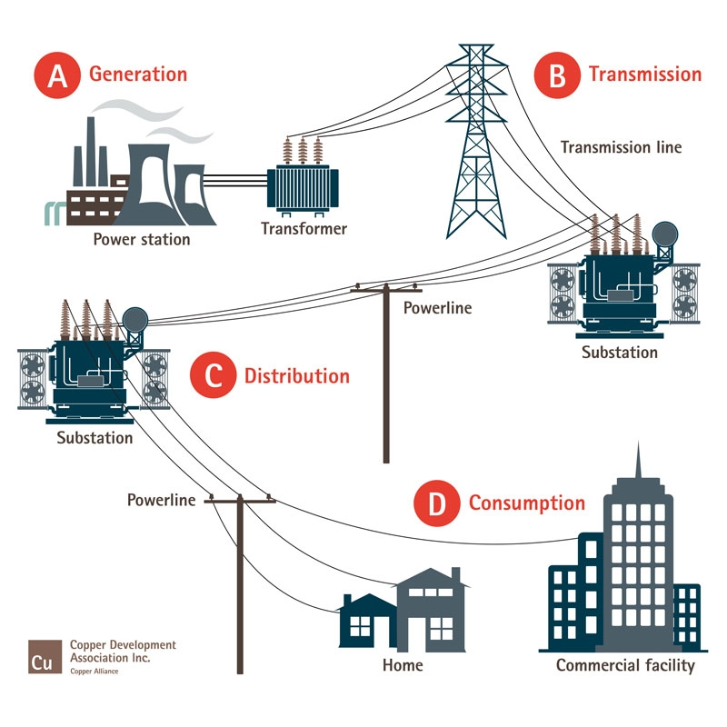
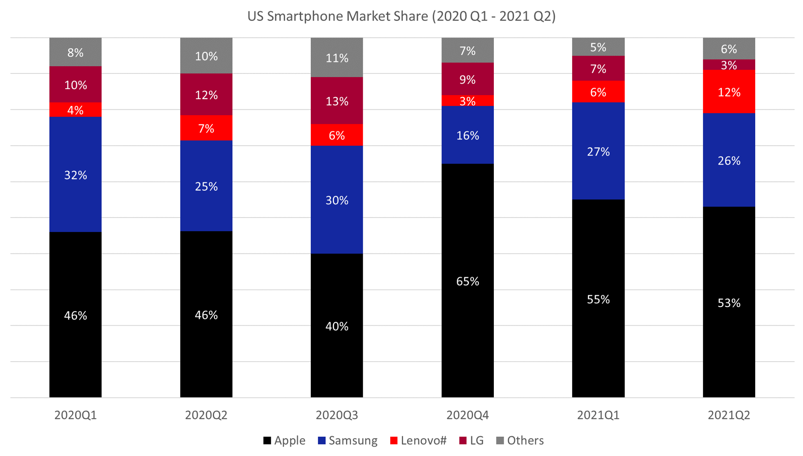

# Cloud Computing

### Cloud computing ensures that resources can be stored and requested on demand over the internet.

  
Companies can consult a **cloud service provider** and rent access to a cloud, in order to cancel the need to organise their own infrastructure to hold data, servers, etc.    

  It's analogous to the Power Grid (the cloud) running through our houses (our local machine). You don't need to hold transformers, or a power plant yourself to get power, you can plug an appliance into a wall socket and access the remote Power Grid which exists and creates power outside your home.

### How can you tell if something is cloud-based\*?
*\*Cloud-based is similar to saying inside the cloud.*
1. You can easily access this thing from another device, or log into the service if it is specifically a server.
2. You have to use a browser to access this thing.
3. You have to use an internet connection to browse for this service.
4. You would (usually) need to pay a periodical fee to maintain your connection to this thing on the cloud.

## On-premises versus Cloud:
### The main difference between these terms is the location: 
* On-prem resources are installed and hosted locally.
  * This is stored using a server infrastructure created by you or your company or school.
* Cloud resources are stored remotely on the cloud provider's servers.
  * You access these resources through a web browser usually.

## Cloud Deployment Models
There are four main deployment models to allow how software on a server is accessed over the internet. 
### 1. Public:
These are services available to anyone using the internet usually within a company. They can be accessed for free or through a subscription service.
**Used by:** Small or medium sized companies.
### 2. Private:
These are services meant to be used by a single organisation. It is **exclusive** to members of the organisation.
 **Used by:** Large companies with necessary security measures on sensitive data (financial/health). 
### 3. Hybrid:
This combines public and private cloud environments. Applications held on this type of cloud can move from public to private environments by an administrator's request.
 **Used by:** Institutions which create public visualisations accessed online, through private financial or healthcare data.
### 4. Multi-Cloud
This combines several cloud services from different providing companies. This could include Amazon Web Services (AWS), Azure, and Google, to ensure you're not relying on a single provider.

## Types of Services
There are three main components which make up cloud computing and what it can provide to a cloud user.
1. **Information as a Service**: offers virtualized resources (e.g. large cloud servers) to perform computations with.
2. **Platform as a Service**: offers a platform and environment for users to run a program on or test code with.
3. **Software as a Service**: offers applications usually through a paid subscription service.

### Advantages:
1. **Recovery**: data is stored and backed-up
2. **Accessibility**: resources can be accessed by a travelling team, or through different time zones.
3. **Secure**: Cloud providers offer distinctly competent security coverage.
### Disadvantages:
1. **Internet required**: Internet is almost always needed to access your cloud-based item.
2. **Third-party provider**: Handing over your data to a cloud provider can create a whole host of problems around security, lack of control, and difficulty changing providers.

## Finance in Cloud Computing

## Expenditure
### ***Capital Expenditure*** are funds allocated by a company used to spend acquiring and maintaining physical items
This could be hardware, land or office blocks. CapEx would be involved in on-prem computing solutions, due to local hardware needing to be installed.  
### ***Operational Expenditure*** are funds used to ensure day-to-day operations continue without error
For example, this could be ensuring salaries are delivered. OpEx would come into play with cloud solutions, as single, monthly payments are made to a provider, which abstracts the allocation of capital.

### Could migrating to a cloud be cheaper than relying on local infrastructures?
The answer is definitely **NO**, not always. It depends on the demands of the business.  
Cloud servers are usually cheaper to maintain than traditional servers, as cloud maintenance costs or upgrades are packaged with the monthly subscription fee.
  Providers tend to offer cheap prices because the cloud services market is quite fluid. There is ample competition and providers would want to edge these through offering cheaper monthly prices, or introducing conditions for large companies for example.

## Competition

### Market share is the term used to describe what **proportion of the market** a company controls, compared to its competitors.   It could also mean [the percent of total sales in an industry generated by a particular company](https://www.investopedia.com/terms/m/marketshare.asp).
In terms of cloud computing, we can start to witness the competition between different providers, such as Amazon, Microsoft, Google and more.
 We can calculate a cloud service provider's market share with **dividing the amount of sales made by the provider by the total amount of sales made by all providers in the industry**.  
  The diagram below details how market share can fluctuate with time, and changing demands with clients.

## Hyperscalers

This is another term for the largest cloud service providers. These are companies that dominate the market.
1. **Amazon Web Services**: AWS has consistently maintained the top status, through its vast array of services and how it emerged so early as a competent provider.
2. **Microsoft Azure**: Very popular with enterprises, due to easy migration to Azure from their legacy (traditional) systems that were Microsoft-based.
3. **Google Cloud**: Its strengths come from its implemented machine learning and analytics handling.
* Honourable Mentions:
  * **IBM Cloud**: Notable for its AI solutions
  * **Alibaba Cloud**: Popular in Asia, particularly China, mainly due to geopolitical tensions between China and USA providers.